# Notes from "The Ultimate Kali Linux Book" by Glen D. Singh


<!-- omit in toc -->
## Contents
- [Chapter 4. Passive Reconnaissance](#chapter-4-passive-reconnaissance)
  - [Exploring Passive Reconnaissance](#exploring-passive-reconnaissance)
  - [Creating a Sock Puppet](#creating-a-sock-puppet)
  - [Anonymizing Internet-Based Traffic](#anonymizing-internet-based-traffic)
    - [Proxychains](#proxychains)
    - [TOR](#tor)
      - [Routing traffice from other applications through TOR](#routing-traffice-from-other-applications-through-tor)
- [Chapter 5. Exploring open-source intelligence](#chapter-5-exploring-open-source-intelligence)
  - [Domain reconnaissance](#domain-reconnaissance)
    - [Collecting WHOIS data](#collecting-whois-data)
    - [Performing DNS enumeration](#performing-dns-enumeration)
      - [`dnsrecon`](#dnsrecon)
      - [Exploiting DNS zone transfer](#exploiting-dns-zone-transfer)
    - [Automating OSINT using SpiderFoot](#automating-osint-using-spiderfoot)
  - [Subdomain harvesting](#subdomain-harvesting)
    - [Enumeration with DNSMap](#enumeration-with-dnsmap)
    - [Subdomain discovery with Knockpy](#subdomain-discovery-with-knockpy)

## Chapter 4. Passive Reconnaissance

Types of information that may be exploited:
- System information
  - Live hosts on a network
  - Hostnames of devices
  - Operating system type and version
  - Running services
  - Open service ports
  - Unauthenticated network shares
  - Usernames and passwords
- Network information
  - DNS records
  - Domain names
  - Sub-domain names
  - Firewall rules
  - IP addresses and network blocks
  - Network protocols and services
- Organizational information
  - Employees' details and contact information
  - Geo-location of the organization and its remote offices
  - Employees' roles and profiles

Both Lockeheed Martin's Cyber Kill Chain and the MITRE ATT&CK framework list reconnaissance as the first step in the attack lifecycle. 

Reconnaissance is broken down into two types:
- Passive reconnaissance: 
  - Information gathering without direct interaction with the target
  - Examples: WHOIS lookups, DNS queries, social media searches
- Active reconnaissance
  - Information gathering with direct interaction with the target
  - Examples: Port scanning, vulnerability scanning, network mapping

Reconnaissance includes a process called **footprinting**, which involves obtaining specific information about a target system or network. 

### Exploring Passive Reconnaissance

- Internet Archive (Wayback Machine): https://archive.org/web/
  - Allows you to view archived versions of web pages
  - Useful for finding old content or changes to a website

- WHOIS Lookup: https://whois.domaintools.com/
  - Provides information about domain ownership and registration details

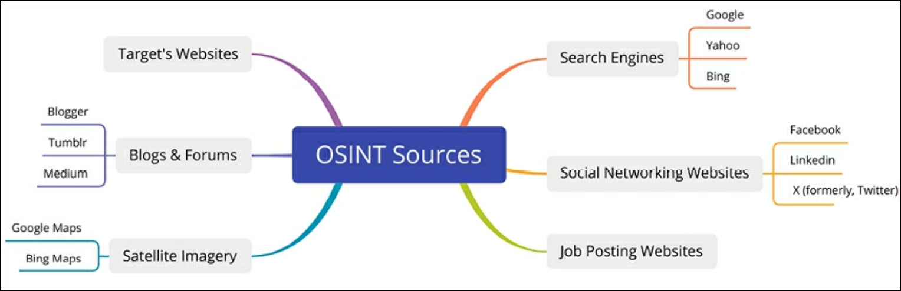


### Creating a Sock Puppet

A sock puppet is a fake online identity used to gather information or interact with others without revealing your true identity.

The following reosurces can be used to create sock puppets:
- Fake Name Generator: https://www.fakenamegenerator.com/
  - Generates random names, addresses, and other personal information
- This Person Does Not Exist: https://thispersondoesnotexist.com/
  - Generates random images of people using AI
- Proxy credit card: https://privacy.com/
  - Provides virtual credit card numbers for online transactions

### Anonymizing Internet-Based Traffic

When using a VPN, ensure your DNS traffic is not leaking outside the VPN tunnel. Use tools like DNS Leak Test  to check for leaks:

- https://www.dnsleaktest.com/

#### Proxychains

Penetration testers use proxychains to route their traffic through multiple proxies, making it difficult to trace back to the original source. Proxychains allow a penetration tester to configure various types of proxies:
- HTTP
- HTTPS
- SOCKS4
- SOCKS5

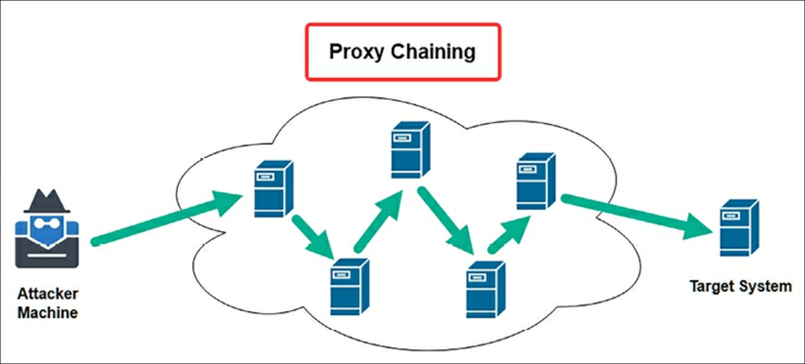

**Finding Free Proxy Servers**: The following website provides a list of free proxy servers:

- https://spys.one/en/

This site uses the following proxy protocols:

| Feature                    | SOCKS5 Proxy                                                  | HTTP Proxy                                                        | HTTPS Proxy                                                                                       |
| :------------------------- | :------------------------------------------------------------ | :---------------------------------------------------------------- | :------------------------------------------------------------------------------------------------ |
| **Purpose**                | General-purpose proxy; works with any traffic type (TCP, UDP) | Web traffic only (HTTP)                                           | Secure web traffic (HTTPS)                                                                        |
| **Protocol Awareness**     | Not aware of application protocols like HTTP/HTTPS            | Understands HTTP (can interpret, modify, or filter HTTP requests) | Understands HTTPS (can recognize encrypted traffic but typically can't see inside)                |
| **Encryption**             | No built-in encryption (just relays data)                     | No encryption                                                     | Depends: encrypts *after* the proxy (client ↔ proxy is usually plain unless using CONNECT method) |
| **Speed**                  | Very fast (minimal processing)                                | Fast, with potential overhead                                     | Slightly slower due to encryption negotiations                                                    |
| **Typical Use Cases**      | Torrenting, gaming, SSH relays, general non-web traffic       | Web browsing without SSL (old websites, simple proxying)          | Secure browsing, accessing HTTPS websites through a proxy                                         |
| **Authentication Support** | Yes (username/password optional)                              | Sometimes                                                         | Sometimes                                                                                         |

**In short:**
- **SOCKS5** is a **raw tunnel**:
  It doesn't care if you're browsing the web, transferring a file, or gaming. It just blindly forwards whatever you send through it. Think of it like a dumb messenger that carries sealed envelopes without peeking inside.
- **HTTP** is specifically for **websites that use regular HTTP (port 80)**:
  The proxy *understands* web traffic, meaning it can modify, cache, or log your web requests. But it's *not secure* because it's not encrypted.
- **HTTPS** proxies are designed for **secure websites (port 443)**:
  They forward encrypted traffic to HTTPS sites. They usually use a "CONNECT" method to establish a tunnel. Your browser does encryption, not the proxy itself, so the proxy doesn't see inside the encrypted communication (unless it's doing "SSL interception," but that's more advanced and rare for public proxies).

To get started with proxychains, (assuming you have already installed it), update the configuration file located at `/etc/proxychains4.conf` to use `dynamic_chain`.


Then scroll down to the section labeled `[ProxyList]`. Comment out the `socks4` line and insert each proxy server you want to use in the following format:  

```bash
[ProxyList]
socks5  23.81.207.111   5256
socks5  98.175.31.195   4145
socks5  67.201.39.14    4145
socks5  104.168.13.108  1080
```
Before using `proxychains`, retrieve your real public IP address:
```bash
curl ifconfig.co
```

Then run a command through `proxychains` to see if your IP address changes:
```bash
proxychains4 -f /etc/proxychains4.conf curl ifconfig.co
```

You can launch other applications through `proxychains` as well:
```bash
proxychains4 -f /etc/proxychains4.conf firefox
```
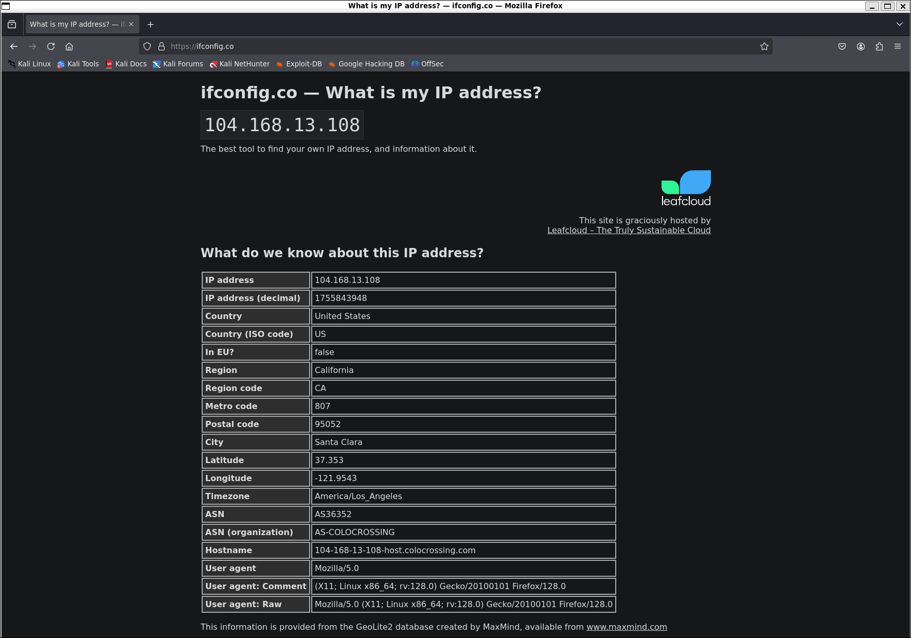

**Note:** The public IP address reflects the last IP address used in the proxy list.

#### TOR

TOR enables a user to route their internet-based traffic through multiple nodes, making it difficult to trace back to the original source. TOR is often used for anonymous browsing and accessing hidden services on the dark web.

How it works:
* When a user sends data through TOR, the TOR app encrypts it in several layers.
* Each node in the TOR network peels off one layer to find out where to send the data next.
* This process repeats at each node until it reaches the final exit node.
* The exit node removes the last layer, finds the real destination, and sends the data there.

The destination will not be able to trace the packet back to the real source, as each TOR node only knows the previous and next nodes in the chain.

TOR's primary goal is anonymity, not security.

Limitations:
* Slower speeds and higher latency.
* Exit-nodes can be insecure and traffic could be intercepted.
* Some websites block TOR exit-node IPs.
* Nodes can be unreliable since they’re volunteer-run.
* TOR has legal and ethical risks due to its link to the dark web.

Confirm if you have `torbrowser-launcher` installed:
```bash
apt list --installed | grep torbrowser-launcher
# or
dpkg -l | grep torbrowser-launcher
```

Install `torbrowser-launcher` if not already installed:
```bash
sudo apt install torbrowser-launcher
```

Launch the TOR browser:
```bash
torbrowser-launcher
```

When the TOR browser opens, click **Connect**:  
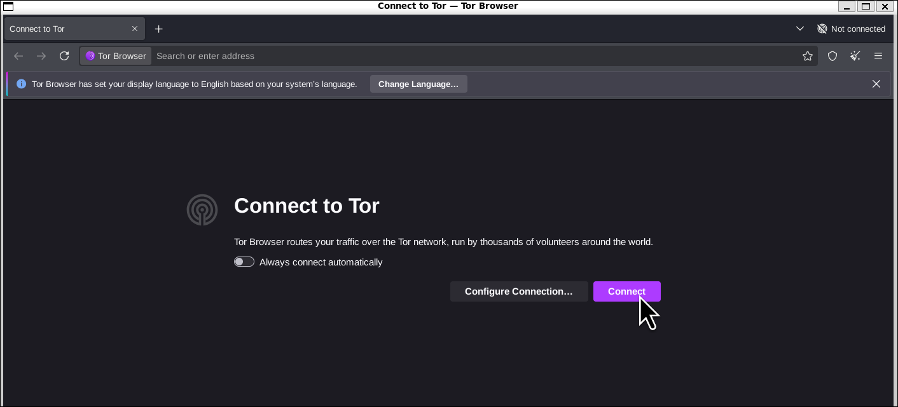

Once the connection is established, use https://ifconfig.co to determine if the traffic is being routed through TOR:

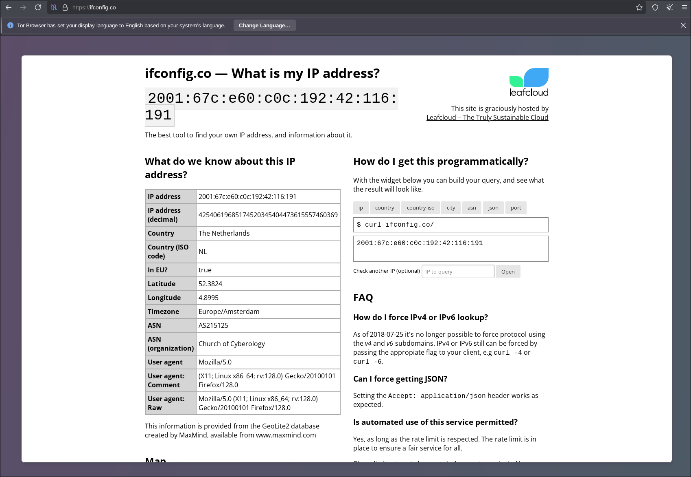

##### Routing traffice from other applications through TOR

To route all traffic from other applications through TOR, you need to use `proxychains` with the TOR SOCKS proxy:

```bash
[ProxyList]
# add proxy here ...
# meanwile
# defaults set to "tor"
socks4  127.0.0.1 9050    # Uncomment to connect via tor

#socks5  104.168.13.108  1080
```
**Note:** Edit using `sudo -E vim /etc/proxychains4.conf`.

Then run the following commands to activate the TOR service:

```bash
sudo systemctl start tor 
sudo systemctl status tor
```
**Output:**  
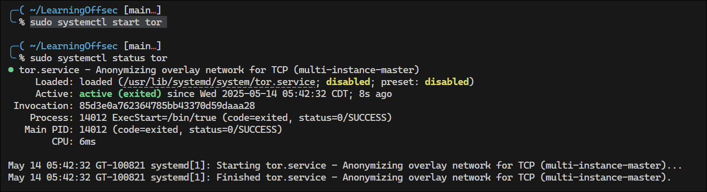

Do a quick check to the TOR website:

```bash
proxychains4 curl https://check.torproject.org
```
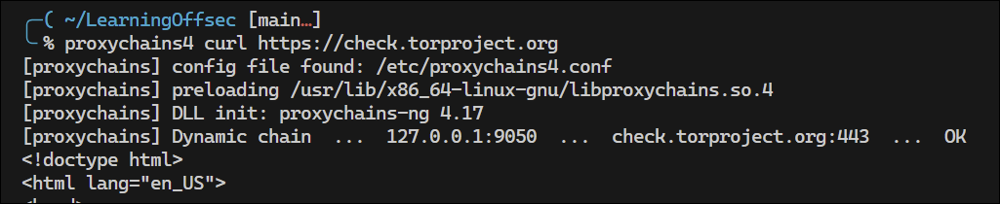

Then launch firefox through `proxychains`:
```bash
proxychains4 firefox
```
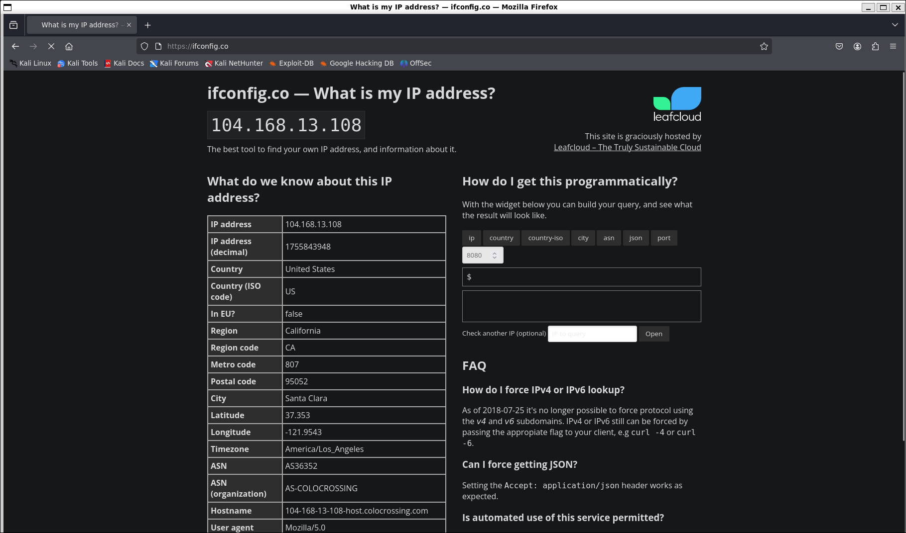

Console output indicates that `proxychains` tunnels connectionsthrough different TOR nodes:

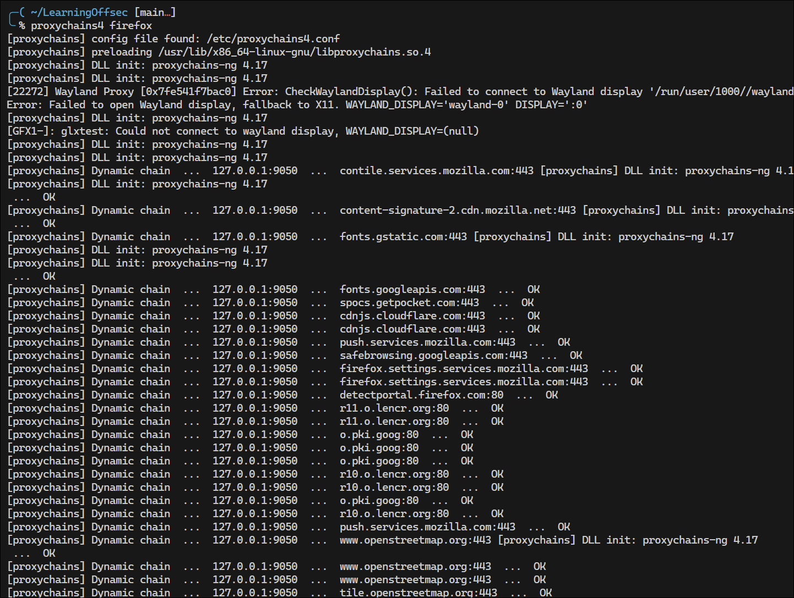

When finished, stop the TOR service:
```bash
sudo systemctl stop tor
sudo systemctl status tor
```

## Chapter 5. Exploring open-source intelligence

### Domain reconnaissance

#### Collecting WHOIS data

The following information can be collected from a WHOIS lookup:
- Registrant contact information
- Administrative contact information
- Technical contact information
- Name servers
- Important dates (registration, update, and expiration)
- Registry domain ID
- Registrar information

**Note:** If the domain owner pays premium for privacy protection, the WHOIS lookup may not return detailed information about the registrant. Instead, it may show a privacy service or proxy contact information.

The following resources can be used to perform WHOIS lookups:
- https://who.is/
- https://www.whois.com/ 
- https://lookup.icann.org/
- https://whois.domaintools.com/

Kali Linux includes the `whois` command-line tool, which can be used to perform WHOIS lookups directly from the terminal:

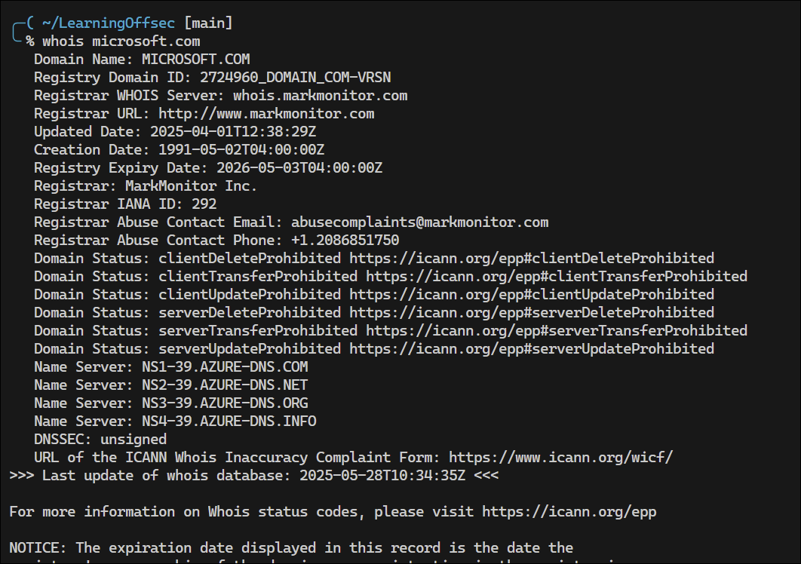


#### Performing DNS enumeration

The following list are trusted DNS providers:
- Cloudflare: https://1.1.1.1
- Quad 9: https://www.quad9.net/
- Cisco OpenDNS: https://www.opendns.com/
- Google Public DNS: https://developers.google.com/speed/public-dns

##### `dnsrecon`

`dnsrecon` is a Python-based DNS reconnaissance tool that can be used to perform various types of DNS enumeration.

Use the following command to retreive the DNS records for a domain:

```bash
dnsrecon -d microsoft.com -n 1.1.1.1
```
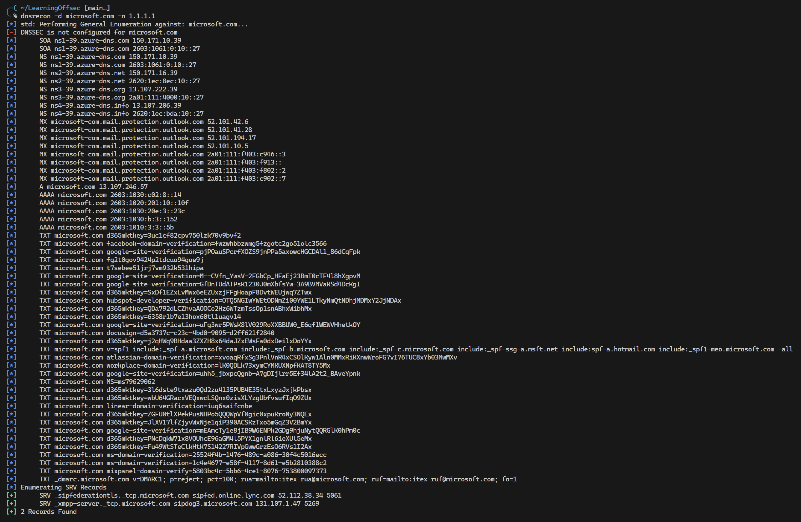


Check to see if DNS servers are misconfigured to allow zone transfers:

```bash
dnsrecon -d microsoft.com -t axfr
```
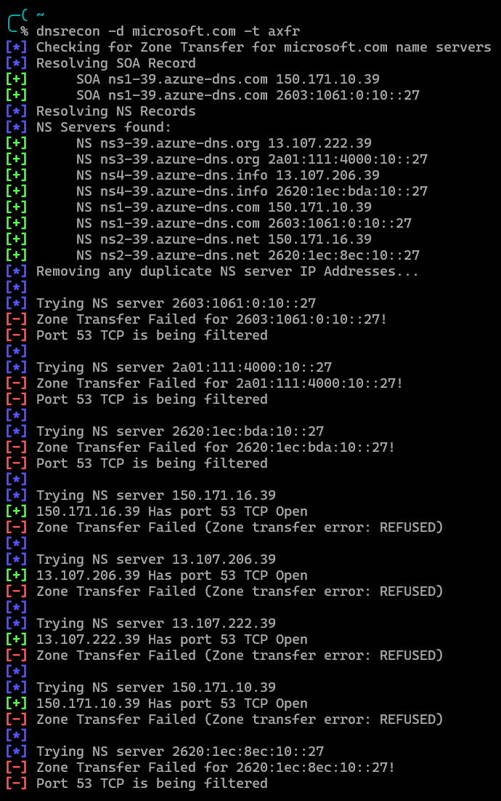

Use brute-force to discover subdomains:

```bash
dnsrecon -d microsoft.com -D subdomains-top1000.txt -t brt
```
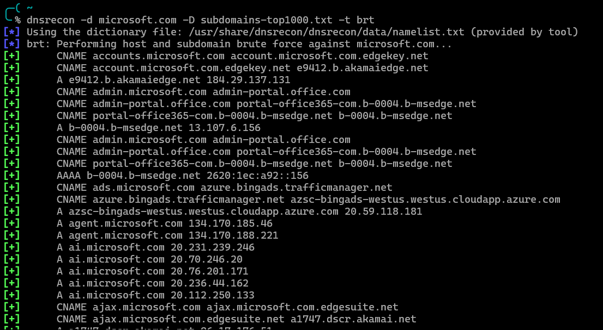

This works by using a wordlist of common subdomains (e.g., `www`, `mail`, `admin`, etc.) to find valid subdomains for the target domain.

The `-D` option specifies the wordlist file. The following screenshot shows the available wordlists:

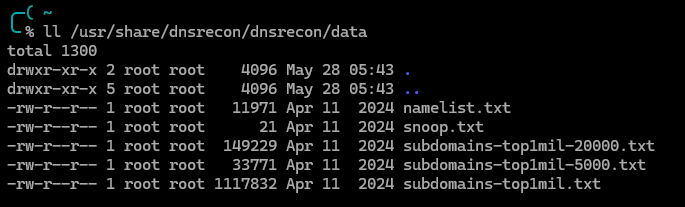

Identify Active Directory, SIP, or LDAP endpoints:

```
dnsrecon -d addomain.local -t srv
```

**Note:** Use the `-j` option to save the results in JSON format.


##### Exploiting DNS zone transfer

DNS zone transfers are a security risk and are not commonly used today in public DNS services. Most public DNS servers use proprietary replication mechanisms and disable the two types of zone transfers, AXFR (full zone transfer) and IXFR (incremental zone transfer), to prevent unauthorized access to DNS records. 

However, zone transfers are still widely used in private/internal networks, e.g. Active Directory, BIND. 

In Active Directory networks, when a DNS zone is AD-integrated, its data is stored in Active Directory and replicated to all domain controllers, not using traditional DNS zone transfer methods. Because of this, zone transfers are usually disabled in AD-integrated zones. You can manually enable zone transfers in AD, but it's rare.

In BIND (Berkeley Internet Name Domain), zone transfers are allowed by default unless explicitly restricted. However, admins will typically use a global restriction policy across all zones to prevent zone transfers to unauthorized IPs.

As a result, the possibility of a poorly configured DNS server is almost non-existent in modern networks.

However, you can use https://digi.ninja/ as an environment to check for DNS zone transfer vulnerabilities.

Use the `host` command to retrieve the DNS records of `zonetransfer.me`:

```bash
host zonetransfer.me
```
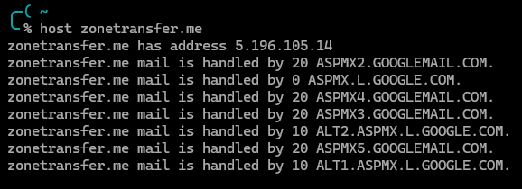

Now retrieve the `NS` records for the domain:

```bash
host -t ns zonetransfer.me
```
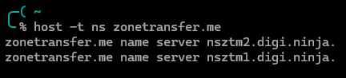

Check each of the nameservers to see if they allow zone transfers:

```bash
host -l zonetransfer.me nsztm2.digi.ninja
```
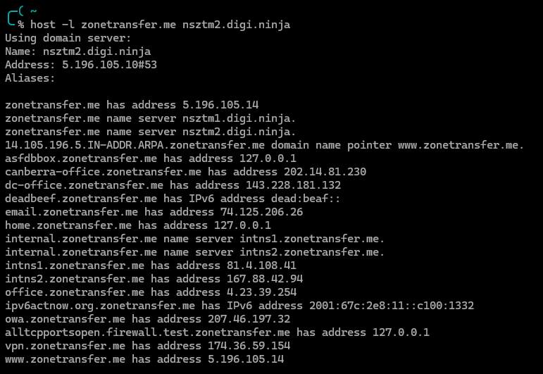

You can also use the `dnsenum` tool across the targeted domain. This tool will attempt to retrieve all DNS records.

```bash
dnsenum zonetransfer.me
```
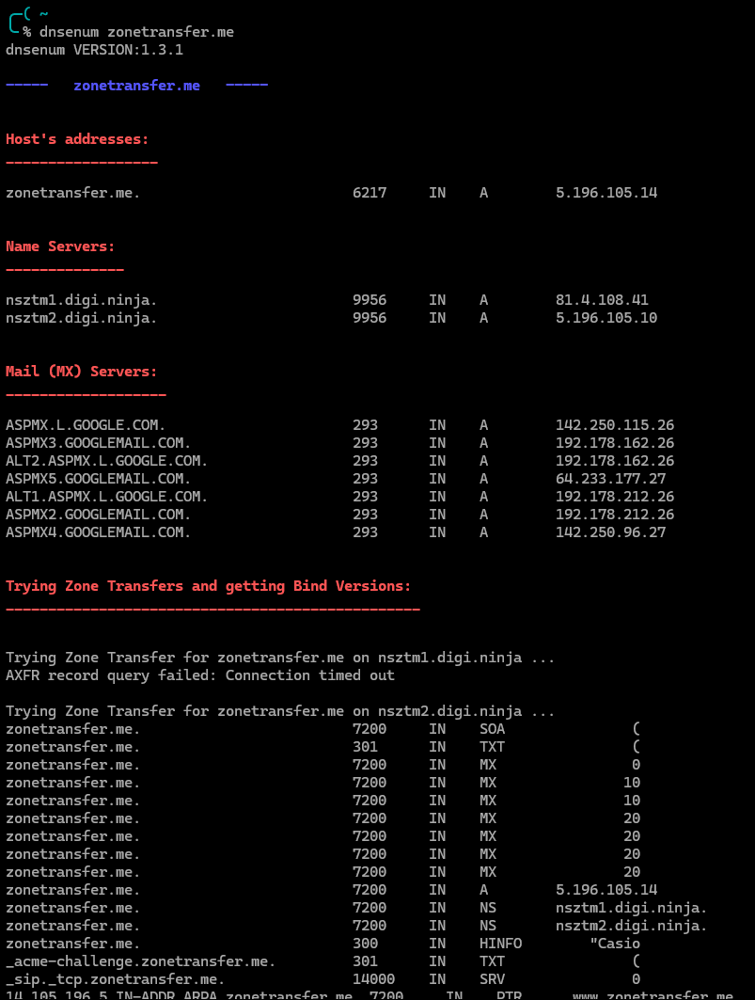

#### Automating OSINT using SpiderFoot

SpiderFoot is a popular OSINT tool that helps reduce time on collecting and analyzing domain-related information.

```bash
╭─( ~/LearningOffsec [main…]
╰╴% spiderfoot -l 0.0.0.0:1234 

*************************************************************
 Use SpiderFoot by starting your web browser of choice and 
 browse to http://127.0.0.1:1234
*************************************************************

2025-06-18 05:06:33,996 [INFO] sf : Starting web server at 0.0.0.0:1234 ...
2025-06-18 05:06:34,005 [WARNING] sf : 
********************************************************************
Warning: passwd file contains no passwords. Authentication disabled.
Please consider adding authentication to protect this instance!
Refer to https://www.spiderfoot.net/documentation/#security.
********************************************************************
```

The `-l` option specifies the IP address and port number for the SpiderFoot web interface, where `0.0.0.0` means it will listen on all available interfaces.

Once launched, navigate to http://127.0.0.1:1234 to access the SpiderFoot web interface.

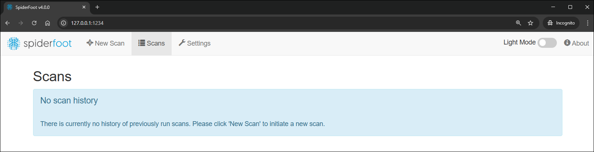

The SpiderFoot web interface showing scan options:

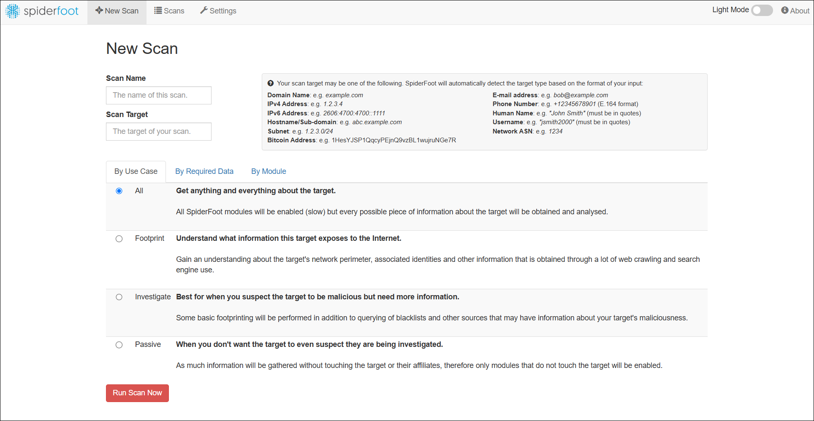

Even a passive scan can take several hours to complete:

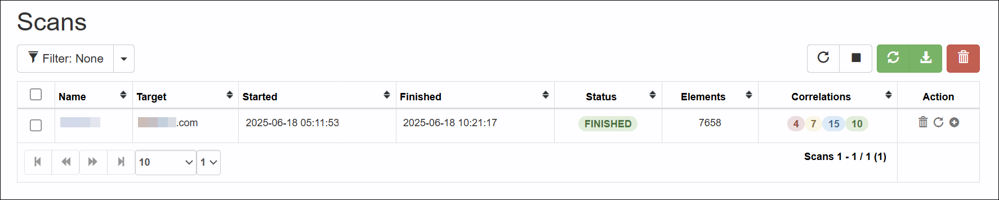

View of the types of data collected:

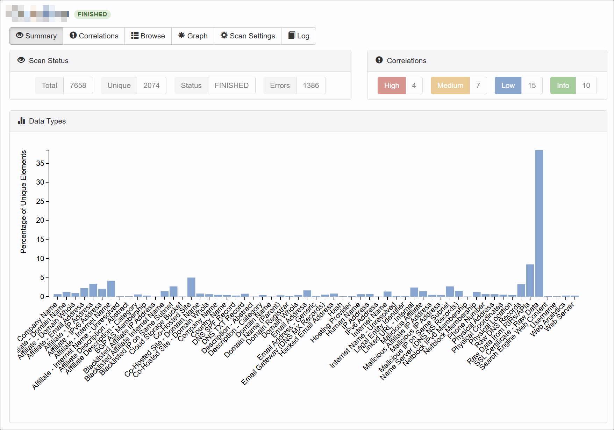

Another view of the data:

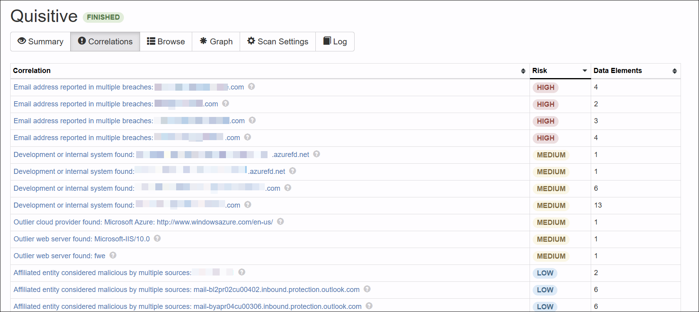

### Subdomain harvesting

#### Enumeration with DNSMap

`dnsmap` attempts to enumerate subdomains by querying a built-in wordlist. It is similar to `dnsrecon` but is purpose-built for discovering subdomains via brute-force.

```bash
dnsmap domain.com     
```
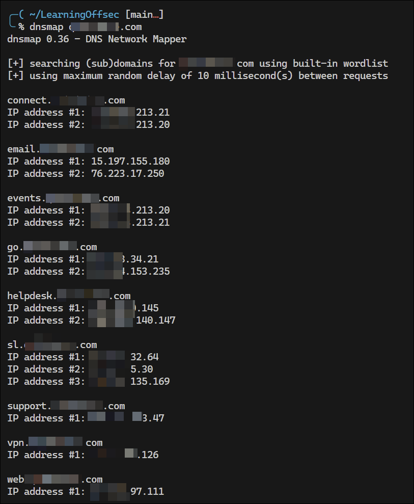

#### Subdomain discovery with Knockpy

`knockpy` is a Python-based subdomain enumeration tool that uses OSINT techniques and data sources, such as search engines and internet indexing platforms.

```bash
knockpy --recon --dns 8.8.8.8 -d quisitive.com
```
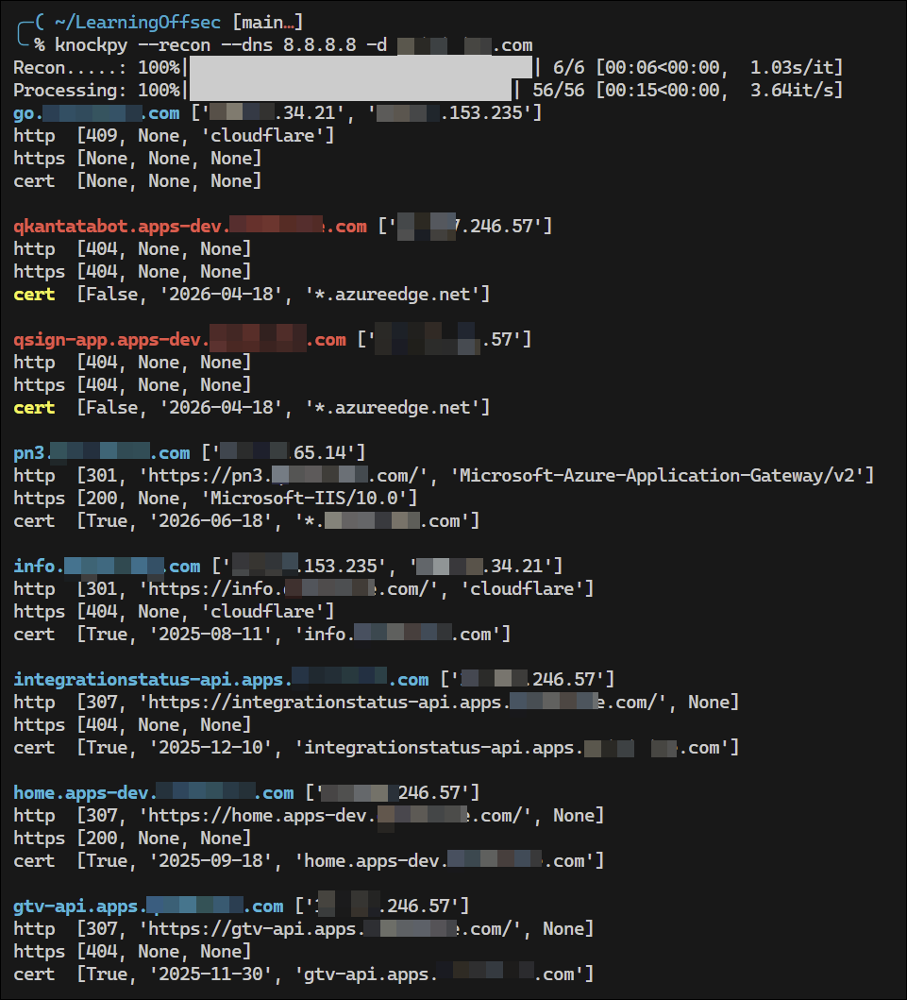
