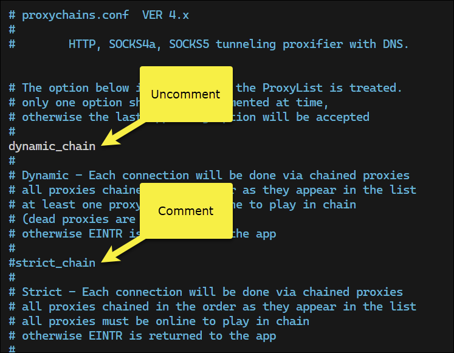

# Notes from "The Ultimate Kali Linux Book" by Glen D. Singh


## Chapter 4. Passive Reconnaissance

Types of information that may be exploited:
- System information
  - Live hosts on a network
  - Hostnames of devices
  - Operating system type and version
  - Running services
  - Open service ports
  - Unauthenticated network shares
  - Usernames and passwords
- Network information
  - DNS records
  - Domain names
  - Sub-domain names
  - Firewall rules
  - IP addresses and network blocks
  - Network protocols and services
- Organizational information
  - Employees' details and contact information
  - Geo-location of the organization and its remote offices
  - Employees' roles and profiles

Both Lockeheed Martin's Cyber Kill Chain and the MITRE ATT&CK framework list reconnaissance as the first step in the attack lifecycle. 

Reconnaissance is broken down into two types:
- Passive reconnaissance: 
  - Information gathering without direct interaction with the target
  - Examples: WHOIS lookups, DNS queries, social media searches
- Active reconnaissance
  - Information gathering with direct interaction with the target
  - Examples: Port scanning, vulnerability scanning, network mapping

Reconnaissance includes a process called **footprinting**, which involves obtaining specific information about a target system or network. 

### Exploring Passive Reconnaissance

- Internet Archive (Wayback Machine): https://archive.org/web/
  - Allows you to view archived versions of web pages
  - Useful for finding old content or changes to a website

- WHOIS Lookup: https://whois.domaintools.com/
  - Provides information about domain ownership and registration details


### Creating a Sock Puppet

A sock puppet is a fake online identity used to gather information or interact with others without revealing your true identity.

The following reosurces can be used to create sock puppets:
- Fake Name Generator: https://www.fakenamegenerator.com/
  - Generates random names, addresses, and other personal information
- This Person Does Not Exist: https://thispersondoesnotexist.com/
  - Generates random images of people using AI
- Proxy credit card: https://privacy.com/
  - Provides virtual credit card numbers for online transactions

### Anonymizing Internet-Based Traffic

When using a VPN, ensure your DNS traffic is not leaking outside the VPN tunnel. Use tools like DNS Leak Test (https://www.dnsleaktest.com/) to check for leaks.

#### Proxychains

Penetration testers use proxychains to route their traffic through multiple proxies, making it difficult to trace back to the original source. Proxychains allow a penetration tester to configure various types of proxies:
- HTTP
- HTTPS
- SOCKS4
- SOCKS5


**NOTE:** The website, https://spys.one/en/, provides a list of free proxy servers.

To get started with proxychains, (assuming you have already installed it), update the configuration file located at `/etc/proxychains4.conf` to use `dynamic_chain`.



Then scroll down to the section labeled `[ProxyList]` and comment out the `socks4` line and insert each proxy server you want to use in the following format:  


Before running proxychains, run the following command to verify your current public IPv4 address:

```bash
curl ifconfig.co
```
